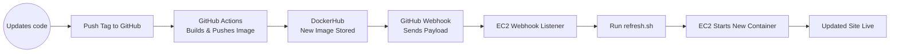

# Continuous Deployment (Project 5)

## Project Overview
This project sets up Continuous Deployment (CD) by automatically updating the running application on an AWS EC2 instance whenever a new Docker image is pushed from GitHub Actions. Project 4 handled CI and building the container image; this project focuses on deploying that image to a live server.

Tools used in this project:
- AWS EC2 – Hosts the live application.
- Docker – Runs the containerized website.
- DockerHub – Stores versioned container images.
- GitHub Actions – Builds/pushes new images and triggers webhooks.
- Webhook – A small service that listens for webhook payloads.
- Systemd – Ensures the webhook listener runs as a background service.

---

# Part 1 — EC2 Setup & Refresh Script

## EC2 Instance Details
- AMI: Ubuntu Server 22.04 LTS  
- Instance Type: t2.medium  
- Storage: 30 GB gp3  
- Security Group Rules:
  - Port 22 (SSH): My IP and WSU IP — for secure remote access.
  - Port 80 (HTTP): 0.0.0.0/0 — required for web traffic.
  - Port 9000 (Webhook Listener): 0.0.0.0/0 — needed so GitHub can send webhook payloads.

## Installing Docker on EC2
Commands used:

```bash
sudo apt update
sudo apt install -y docker.io
sudo systemctl enable docker
sudo systemctl start docker
```
Verifying Docker: 
```bash 
docker --version
sudo docker run hello-world
```
Pulling the image: 
- `sudo docker pull austinwsu/project4-site:latest`
Running the container: 
- `sudo docker run -d -p 80:80 --name site austinwsu/project4-site:latest`
- The diffrence between -d vs -it
    - -it: interactive mode used for debugging, attaches to terminal.
    - -d: runs detached in the background, -d is for deployment (in my opinion).

Viewing the site to confirming it is working:
- `http://54.85.117.137/`

## Refresh Script
This script handles stopping the old container, pulling the new version, and starting the updated one.

Testing the script: 
```bash
chmod +x refresh.sh
./refresh.sh
```
If the site loads after running it, the script should be working.
- [refresh.sh](deployment/refresh.sh)

--- 

# Part 2 - Webhook

## Installing Webhook
```bash
sudo apt update
sudo apt install -y webhook
```
Run `webhook --version`, if it says the version then it installed successfully.

Summary: 
- Watches for webhook calls to /hooks/deploy-site.
- Checks that the payload came from this GitHub repo.
- Runs the refresh.sh script when conditions match.

Verifying the defention file was loaded: 
- `webhook -hooks /home/ubuntu/deployment/hooks.json -port 9000`
    - How I verified it was by not seeing any errors.
- [hooks](deployment/hooks.json)

### Webhook Service

How to Enable and Start: 
```bash
sudo cp ./webhook.service /etc/systemd/system/
sudo systemctl daemon-reload
sudo systemctl enable webhook
sudo systemctl start webhook
sudo systemctl status webhook
```

What to look for in webhook logs: 
    - `sudo journalctl -u webhook -f`

- Payload received
- Matching trigger-rule
- Script executed
- Docker stop/pull/run commands

- [webhook.service](deployment/webhook.service)

---

# Part 3 - Sending Payload

## Why I chose Github Webhook: 

- Integration with GitHub Actions builds
- Ability to trigger on tag pushes, which matches our workflow

## Setting Up the GitHub Webhook

### Navigate to:

`GitHub Repo` → `Settings` → `Webhooks` → `Add Webhook`

### Settings used:
- Payload URL: http://54.85.117.137:9000/hooks/deploy-site
- Content Type: application/json
- Event Trigger: Workflow run completed

### What triggers the webhook?
- A git tag push
- This starts the GitHub Action
- Action builds + pushes Docker image
- GitHub sends payload
- EC2 receives it
- Webhook runs refresh.sh
- New container launches on server

## Verifying Delivery
1. Push a new tag: 
    - `git tag -a v1.0.2 -m "Updated site"`
    - `git push origin v1.0.2`
2. Watch Github Actions
3. Check DockerHub
4. Check Instance webhook logs: 
    - `sudo journalctl -u webhook -f`
6. Reload wepage: 
    - `http://54.85.117.137/`

# Diagram



# Resources

I used all of the resources that you provided in the Instructions, I also spent a lot of time (about 8-7 hours...) going back and rewatching classes when I ran into issues which helped out a ton.

- `https://github.com/adnanh/webhook`
- used this GitHub repo as the source for the webhook listener tool installed on the instance.

- `https://levelup.gitconnected.com/automated-deployment-using-docker-github-actions-and-webhooks-54018fc12e32`
- This one had a -verbose tag on one of the webhook lines and I used it, after looking it up. I also just read through this if I got stuck. 

- `https://blog.devgenius.io/build-your-first-ci-cd-pipeline-using-docker-github-actions-and-webhooks-while-creating-your-own-da783110e151`
- I went through this blog and helped me with multiple different commands.

- `https://linuxhandbook.com/create-systemd-services/`
- Used this tutorial to create and configure a systemd service file.

- `https://github.blog/developer-skills/github/include-diagrams-markdown-files-mermaid/`


