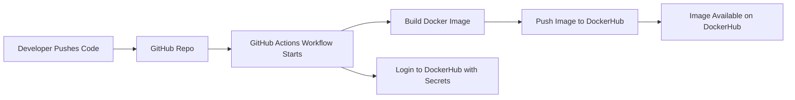

# CI (Project 4)

## Project Overview
This project sets up a simple CI pipeline using GitHub Actions, Docker, and DockerHub.  

### Main goals:
- Build a Docker image using a Dockerfile.
- Store the image on DockerHub.
- Use GitHub Actions to build and push the image.
- Explain how everything works and show a diagram of the CI process.

# Tools Used
### GitHub
Stores the repository and runs the GitHub Actions workflows.

### GitHub Actions
Handles the automation for building and pushing the Docker image.

### Docker
Used to containerize the website.

### DockerHub
Stores the container images built by GitHub Actions.

### httpd:2.4
Apache web server image used as the base for serving the site.

# Continuous Integration Diagram

## Web Content

The website files live inside the web-content folder.
They include:
- index.html
- about.html
- styles.css

This is the website that the container will serve.

## Dockerfile

The Dockerfile is at the root of the project.

It looks like this:
- `FROM httpd:2.4
- COPY ./web-content/ /usr/local/apache2/htdocs/`

This tells Docker to:
- Use the Apache web server image.
- Copy the website files into the folder Apache uses for web pages.

## Building and Running the Container Locally
Build the image:
- `docker build -t austinwsu/project4-site:latest .`

Run the container:
- `docker run -d --name project4-test -p 8080:80 austinwsu/project4-site:latest`

Open your browser and go to:
- `http://localhost:8080`

Stop the container:
- `docker stop project4-test`
- `docker rm project4-test`

## GitHub Repository Secrets

To let GitHub Actions log in to DockerHub, two secrets must be added:

DOCKER_USERNAME
- `austinwsu`

DOCKER_TOKEN
- `Enter PAT`

A DockerHub Personal Access Token (PAT).
- Created in DockerHub → `Account Settings` → `Security` → `New Access Token`

Add these in:
- GitHub Repo → `Settings` → `Secrets` → `Actions`

GitHub Actions Workflow (CI)

The workflow file is located here:
- `.github/workflows/release-dockerhub.yml`

What it does:
- Checks out the code.
- Logs into DockerHub.
- Builds the Docker image.
- Tags the image.
- Pushes the new image to DockerHub.

When it runs:

The workflow runs when you push a tag that looks like:

- `v1.0.0`
- `v1.1.0`
- `v2.0.0`

## Testing the CI Pipeline
1. Create a tag:
`git tag -a v1.0.0 -m "First version"`
`git push origin v1.0.0`

2. Check GitHub Actions

Go to the Actions tab in GitHub.
- You should see a run triggered by `v1.0.0`.

3. Check DockerHub

Go to your DockerHub image page:
- `https://hub.docker.com/r/austinwsu/project4-site/tags`

You should see tags like:
- `latest`
- `1`
- `1.0`

4. Test the versioned image:
- `docker pull austinwsu/project4-site:1.0`
- `docker run -d -p 8082:80 --name version-test austinwsu/project4-site:1.0`

Visit:
`http://localhost:8082`

If it loads, everything worked!

# Resources
Docker
`https://docs.docker.com/`
- I used a bunch of different sections on the dockers docs site so I just linked the whole thing.
- Used for building and testing the container locally.

GitHub Actions
`https://docs.github.com/en/actions`
- Used for automating the build/push process.

DockerHub httpd Base Image
`https://hub.docker.com/_/httpd`
- Helped me with the Dockerfile.

Mermaid Diagramming
`https://mermaid.js.org/`
- First time using mermaid to make the diagram. It went decently pretty good.
- Used to create the pipeline diagram.

AI Assistance
ChatGPT
Prompt Used:
"Create me a index and css file, you can do a very basic website. Do it about ARC raiders."